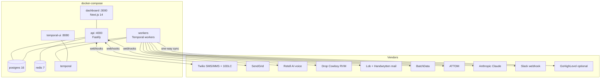
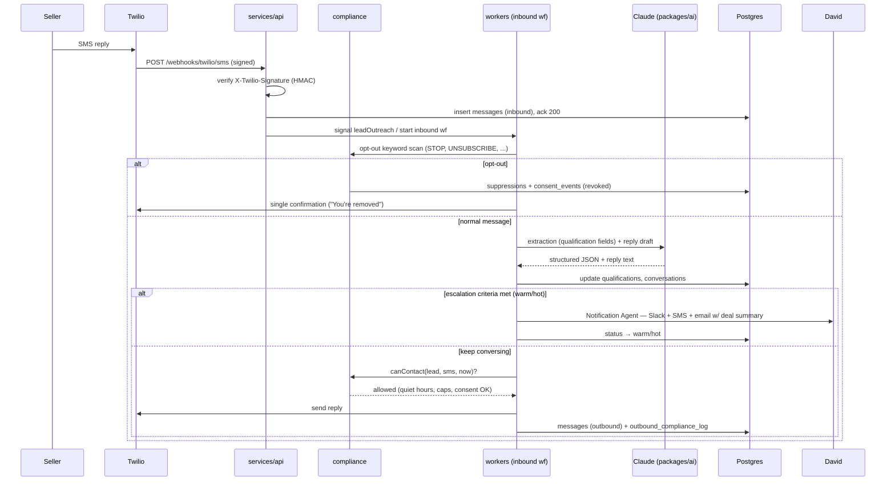

# DealEngine — System Architecture

> **Audience:** engineers working on the platform, and David as owner/operator.
> **Status:** matches the monorepo as built. If code and this doc disagree, fix one of them the same day.

DealEngine is a production AI acquisitions platform for off-market residential real estate (wholesale/flip). It runs the entire top-of-funnel — list pull, enrichment, skip trace, scoring, multi-channel outreach, AI conversation, qualification, underwriting — and stops at the human boundary: when a seller is **warm** or **hot**, the platform notifies David (Slack + SMS + email with a deal summary) and he personally negotiates and closes. The platform never negotiates price and never signs anything.

## 1. Design principles

1. **Postgres is the system of record.** Every lead, message, consent event, and score lives in Postgres 16. GoHighLevel sync (if enabled) is one-way, out. No vendor owns our data.
2. **Compliance gates every outbound.** No SMS, call, RVM, email, or mail piece leaves the system without passing `packages/compliance` (quiet hours per state, suppression, opt-out, frequency caps, consent checks, kill switch). This is a hard architectural invariant, not a convention.
3. **Durable workflows, not cron + queues.** Outreach cadences run for weeks per lead. Temporal gives us durable timers, automatic retries, and per-lead visibility that a cron/Redis-queue design cannot.
4. **Claude where judgment is needed, deterministic code everywhere else.** Conversation, extraction, and deal summaries are Claude-powered (`claude-opus-4-8` by default, per-agent env override). Scoring math, underwriting math, dedupe, and the status machine are deterministic and testable.
5. **One operator.** The dashboard and notification design assume a single human in the loop. There is no team-permission model in v1.

## 2. Markets

Twelve markets across eight states: Columbus OH, Toledo OH, San Antonio TX, Houston TX, Jacksonville FL, Orlando FL, Atlanta GA, Augusta GA, Memphis TN, Knoxville TN, Indianapolis IN, Baltimore MD. Each market is a row in `markets` with its own county FIPS list, timezone, buy-box config, and per-state compliance profile. The `dailyPipeline` Temporal workflow runs once per market per day.

## 3. High-level system flow

```mermaid
flowchart LR
    subgraph Sources
        BD[BatchData lists]
        AT[ATTOM detail/comps/AVM]
        CTY[County records]
    end
    subgraph Ingestion
        LG[Lead Generation Agent]
        DC[Data Cleaning Agent<br/>normalize + dedupe]
    end
    subgraph Enrichment
        PI[Property Intelligence Agent<br/>ATTOM enrichment]
        ST[Skip Trace Agent<br/>BatchData → IDI/Enformion waterfall]
    end
    SC[Lead Scoring Agent<br/>0–100 weighted distress signals]
    subgraph Outreach
        FU[Follow-Up Manager<br/>Temporal leadOutreach]
        CH[Channel managers:<br/>SMS / Email / RVM / Call / Mail]
    end
    CMP{{Compliance Engine<br/>gates EVERY outbound}}
    CV[Conversation Agent<br/>Claude, SMS-first]
    QL[Qualification Agent<br/>Claude extraction]
    UW[Underwriting<br/>ARV / MAO / repair / flip / BRRRR]
    NT[Notification Agent<br/>Slack + SMS + email]
    DH[David<br/>human close]

    BD --> LG
    AT --> PI
    CTY --> LG
    LG --> DC --> PI --> ST --> SC --> FU
    FU --> CMP --> CH
    CH -->|inbound reply| CV
    CV --> QL --> UW
    QL -->|warm / hot| NT --> DH
    CV -->|reply| CMP
```

Every arrow into a seller's phone/inbox/mailbox passes through the compliance engine — including Claude-generated replies.

## 4. Monorepo layout

npm workspaces, TypeScript, Node 20.

| Path | Purpose |
|---|---|
| `packages/shared` | Types, config loader, `pg` pool, pino logger. Zero business logic. |
| `packages/compliance` | Per-state quiet hours, opt-out keyword handling, suppression list, frequency caps, consent checks, audit writes. Exposes `canContact(lead, channel, now)` — the single gate. |
| `packages/scoring` | Weighted distress-signal lead scoring, 0–100. Deterministic; Claude assist optional for ambiguous records via nightly Batches API run. |
| `packages/underwriting` | ARV = weighted comps + AVM blend; repair estimator ($/sqft by level: light/medium/heavy/gut); **MAO = ARV × rulePct − repairs − assignment fee**; holding/closing costs; flip profit; rent/CoC; BRRRR model. |
| `packages/ai` | Claude conversation engine, structured extraction, deal summaries. `@anthropic-ai/sdk`. Model per agent via `AI_MODEL_CONVERSATION`, `AI_MODEL_EXTRACTION`, `AI_MODEL_SCORING`, `AI_MODEL_SUMMARY` (default `claude-opus-4-8`; downgrade to `claude-sonnet-5` / `claude-haiku-4-5` for cost). |
| `packages/integrations` | Vendor adapters: Twilio, SendGrid, Retell AI, Drop Cowboy, Lob, Handwrytten, BatchData, ATTOM, PropertyRadar, IDI/Enformion, Slack webhook, GoHighLevel. |
| `services/api` | Fastify REST + vendor webhooks. Port **4000**. |
| `services/workers` | Temporal workers: `dailyPipeline` (per market), `leadOutreach` (per lead), inbound message processing. |
| `apps/dashboard` | Next.js 14 operator dashboard. Port **3000**. |
| `db/migrations` | PostgreSQL 16 migrations. |

## 5. Infrastructure

- **Local/dev:** everything above via `docker compose up`.
- **Production reference:** GCP Cloud Run (api, workers, dashboard) + Cloud SQL Postgres + Memorystore Redis + Temporal Cloud. Budget alternative: one Hetzner/EC2 box running the same compose file. See `04-deployment.md`.

## 6. Data model (high level)

Core tables (see `db/migrations` for authoritative DDL):

| Table | Notes |
|---|---|
| `markets` | 12 rows; timezone, state, county FIPS, buy-box, compliance profile. |
| `properties` | One row per parcel; ATTOM enrichment (beds/baths/sqft, AVM, last sale, liens, foreclosure status). |
| `owners` / `contacts` | Owner entities and skip-traced phones/emails with per-contact type (mobile/landline), source, and confidence. |
| `leads` | Property × owner × market. Carries `status` (state machine below), `score`, distress signals, assigned cadence. |
| `messages` | Every inbound/outbound across all channels; direction, channel, body, vendor SIDs, Claude request ids. |
| `conversations` | Threaded per lead-contact; Claude context window is rebuilt from here. |
| `qualifications` | Structured extraction: motivation, timeline, asking price, condition, occupancy, mortgage status. Updated on every inbound message. |
| `valuations` / `comps` | Underwriting runs: ARV, MAO, repair estimate, comp set snapshot. |
| `consent_events` | Every consent grant/revoke with source, timestamp, raw evidence. |
| `outbound_compliance_log` | One row per attempted outbound: gate result (allowed/blocked), rule that fired, snapshot of caps/quiet-hours evaluation. Append-only. |
| `suppressions` | DNC, opt-outs, litigator matches, manual blocks. Checked on every send. |
| `kpi_daily` | Per-market materialized rollups for the dashboard. |

### Lead status machine

`new → enriching → skip_traced → scored → in_outreach → conversing → warm → hot → appointment → offer_made → under_contract → closed_won | closed_lost`, with side states `nurture`, `dead`, `suppressed` reachable from most stages. Transitions are owned by the Pipeline Manager (deterministic); no other module writes `leads.status` directly.

## 7. Inbound SMS sequence

Notes:
- The webhook handler does the minimum (verify, persist, ack) and hands off to Temporal — Twilio retries are safe because inserts are idempotent on `MessageSid`.
- Extraction runs on **every** inbound message, not just "interesting" ones — see `06-agents.md`.
- Even a conversational reply is compliance-gated: a seller texting at 11pm gets their reply queued to 8am their local time unless the message is a required opt-out confirmation.

## 8. Why Temporal

The `leadOutreach` workflow is a **durable multi-day/multi-week cadence**: e.g. Day 0 SMS → Day 2 SMS → Day 4 RVM → Day 7 email → Day 10 cold call → Day 14 postcard → nurture loop. Reasons Temporal over cron/BullMQ:

1. **Durable timers measured in days.** `sleep('3 days')` survives deploys, crashes, and worker restarts. No orphaned jobs, no timer tables.
2. **Per-lead visibility.** Temporal UI (port 8080) shows exactly where every lead is in its cadence, its history, and its pending timer — invaluable when a seller calls David and he needs to know what the machine already said.
3. **Retries with idempotency.** Vendor calls (Twilio, BatchData) are activities with automatic retry policies; workflow code stays deterministic.
4. **Signals.** An inbound reply signals the workflow to abort remaining cadence steps and switch to conversation mode. A status change to `suppressed` cancels it instantly.
5. **Fan-out control.** `dailyPipeline` per market fans out enrichment/skip-trace/scoring activities with concurrency limits that respect vendor rate budgets (see `07-scaling-security.md`).

## 9. Service responsibilities

- **services/api** — Fastify. Routes: `/webhooks/twilio/*`, `/webhooks/sendgrid/*`, `/webhooks/retell/*`, REST for dashboard (`/leads`, `/conversations`, `/kpis`, `/settings`), health checks. Verifies every webhook signature. API-key auth for dashboard routes.
- **services/workers** — Hosts all Temporal workflows and activities. Also the only process that calls paid vendor APIs (single place to enforce rate budgets and spend caps).
- **apps/dashboard** — Next.js 14: pipeline board by status, conversation viewer with takeover ("pause AI, I've got this"), per-market KPIs from `kpi_daily`, compliance panel (suppression count, blocked-send log, kill switch state).

## 10. Configuration surface (selected)

| Env var | Purpose |
|---|---|
| `OUTBOUND_ENABLED` | Global kill switch. `false` blocks all channels at the compliance gate. |
| `SMS_WEEKLY_CAP` | Per-lead weekly SMS frequency cap. |
| `AI_MODEL_CONVERSATION` etc. | Per-agent Claude model override (default `claude-opus-4-8`). |
| `DNC_SCRUB_KEY` | Optional DNC scrub vendor key; when unset, DNC scrubbing must be done at list level before import. |

The full `.env.example` walkthrough is in `04-deployment.md`.
